# Cars Marketplace - Comprehensive Codebase Analysis

## Executive Summary

**بورصتي** (Borsati) is a modern Arabic car marketplace platform built with Next.js 15, targeting the Mauritanian market. The application facilitates car buying and selling with a focus on Arabic language support (RTL), modern UI/UX, and robust authentication/authorization systems.

> **Note on Mermaid Diagrams**: If diagrams are not rendering in your markdown preview, install the "Markdown Preview Mermaid Support" extension in VS Code or view this file on GitHub where Mermaid is natively supported.

## Table of Contents

1. [Technical Architecture](#technical-architecture)
2. [Software Architecture Analysis](#software-architecture-analysis)
3. [Developer Perspective](#developer-perspective)
4. [Product Management Analysis](#product-management-analysis)
5. [User Stories](#user-stories)
6. [Database Design](#database-design)
7. [Security & Authentication](#security--authentication)
8. [Performance & Scalability](#performance--scalability)
9. [Technical Debt Analysis](#technical-debt-analysis)
10. [Recommendations](#recommendations)

---

## Technical Architecture

### Technology Stack

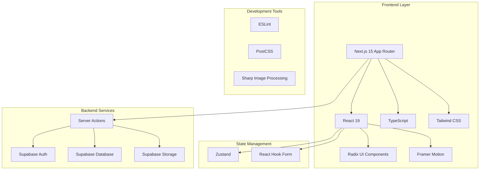

### Application Architecture

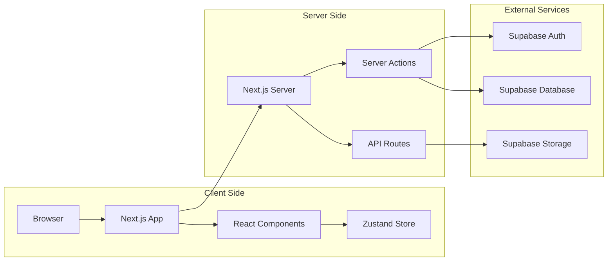

---

## Software Architecture Analysis

### Project Structure

The codebase follows a **feature-based architecture** with clear separation of concerns and **Route Groups** for layout organization:

```
src/
├── app/                    # Next.js App Router pages
│   ├── layout.tsx         # Root layout (minimal - no header/footer)
│   ├── (public)/          # Route group for public pages
│   │   ├── layout.tsx     # Public layout with header/footer
│   │   ├── page.tsx       # Homepage
│   │   ├── about/         # About pages
│   │   ├── cars/          # Car browsing pages
│   │   ├── profile/       # User profiles
│   │   └── favorites/     # Favorites page
│   ├── (auth)/            # Route group for authentication
│   │   ├── layout.tsx     # Auth layout (clean, minimal)
│   │   ├── login/         # Login pages
│   │   ├── signup/        # Registration pages
│   │   └── forgot-password/ # Password reset
│   ├── dashboard/         # Seller dashboard (separate layout)
│   │   ├── layout.tsx     # Dashboard layout with sidebar
│   │   ├── listings/      # Listing management
│   │   └── settings/      # User settings
│   └── api/               # API endpoints
├── components/            # Shared UI components ONLY
│   ├── ui/               # Base UI components (shadcn/ui)
│   ├── layout/           # Layout components (header, footer, sidebar)
│   ├── icons.tsx         # Centralized icon definitions
  │   └── (moved to features/home/components/)
├── features/             # Feature-based modules
│   ├── auth/            # Authentication logic
│   ├── home/            # Homepage components
│   │   └── components/
│   │       ├── hero-section.tsx    # Main hero component
│   │       ├── testimonials.tsx    # Testimonials section
│   │       └── featured-cars.tsx   # Featured cars grid
│   ├── listings/        # Car listing management
│   │   └── components/
│   │       └── form-card-skeleton.tsx  # Form loading states
│   ├── public-listings/ # Public car browsing
│   └── favorites/       # Client-side favorites (Zustand + localStorage)
├── types/               # TypeScript type definitions
│   └── index.ts         # Centralized type exports
├── utils/               # Utility functions
└── hooks/               # Custom React hooks
```

### Design Patterns

1. **Route Groups Pattern**: Uses Next.js Route Groups `(public)`, `(auth)` for layout organization
2. **Server Actions Pattern**: Leverages Next.js 15 server actions for data mutations
3. **Feature Module Pattern**: Each feature is self-contained with its own components, actions, and types
4. **Repository Pattern**: Database operations abstracted through server actions
5. **Component Composition**: Extensive use of Radix UI for accessible components
6. **Client-Side State Management**: Zustand with localStorage persistence for favorites
7. **Layout Composition**: Hierarchical layouts with route-specific headers/footers

### Data Flow Architecture

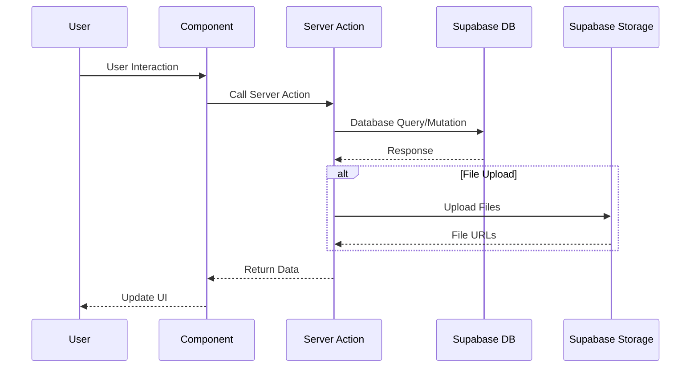

---

## Developer Perspective

### Code Quality & Maintainability

#### Strengths

- **Type Safety**: Comprehensive TypeScript usage with auto-generated database types
- **Modern React**: Uses React 19 with latest patterns (Server Components, Server Actions)
- **Clean Architecture**: Route Groups pattern for layout organization
- **Component Organization**: Clear separation between shared and feature-specific components
- **Consistent Styling**: Tailwind CSS with custom design system
- **Component Reusability**: Well-structured UI component library based on shadcn/ui
- **Internationalization Ready**: Arabic language support with RTL layout
- **Centralized Types**: Unified type system with centralized exports

#### Technical Debt & Areas for Improvement

1. **Testing**: No visible testing infrastructure (HIGH PRIORITY)
2. **Error Handling**: Inconsistent error handling patterns across server actions
3. **Validation**: Mixed validation approaches (Zod schemas vs manual validation)
4. **Documentation**: Limited inline documentation
5. **Performance**: No visible optimization for large datasets

#### Recent Improvements ✅

1. **Component Cleanup**: Removed unused components (Navigation, duplicate hero/testimonials)
2. **Proper Organization**: Moved components to feature-specific locations
3. **Build Optimization**: Fixed icon imports and missing components
4. **Layout Architecture**: Confirmed optimal Route Groups implementation
5. **Type Organization**: Centralized type definitions with proper exports

### Development Workflow

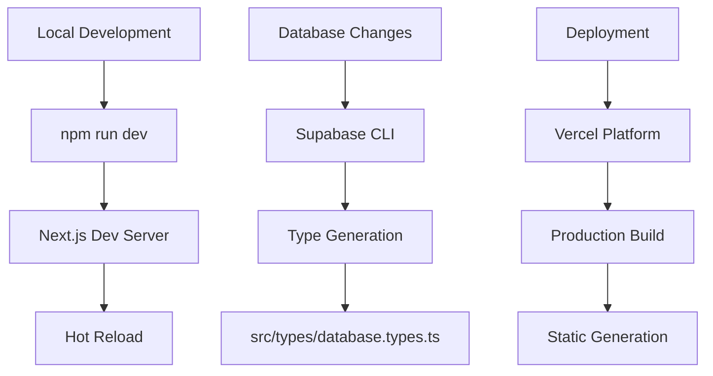

### Key Technical Features

1. **Authentication System**

   - Supabase Auth integration
   - Role-based access control (buyer/seller/admin)
   - Protected routes and middleware

2. **File Upload System**

   - Multi-file upload with drag & drop
   - Image optimization with Sharp
   - Supabase Storage integration

3. **Real-time Features**
   - Potential for real-time updates (Supabase subscriptions)
   - Optimistic UI updates

---

## Product Management Analysis

### Business Model

**بورصتي** operates as a **two-sided marketplace** connecting car sellers and buyers in Mauritania.

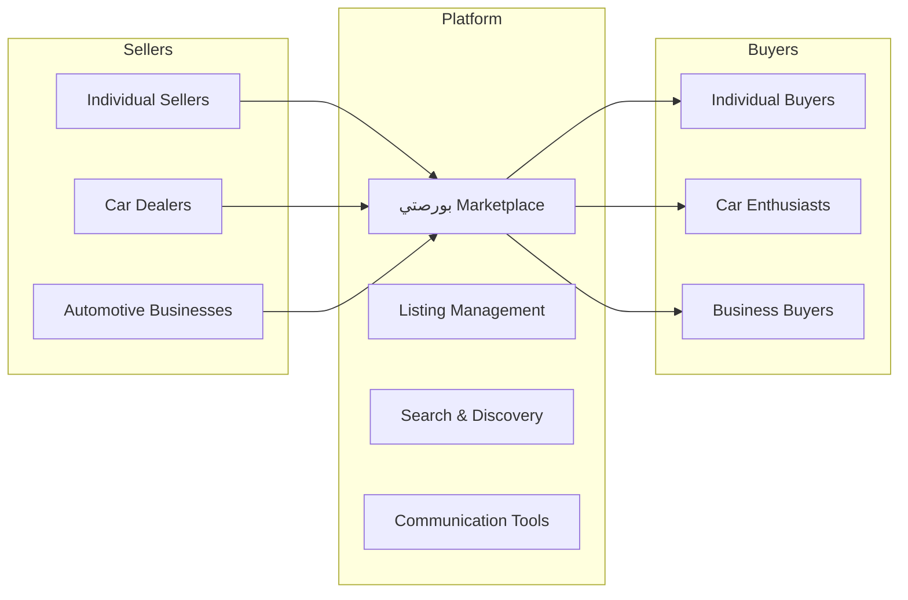

### User Personas

1. **Car Sellers**

   - Individual car owners looking to sell
   - Professional dealers
   - Need: Easy listing creation, visibility, lead management

2. **Car Buyers**
   - First-time car buyers
   - Car enthusiasts
   - Need: Search functionality, detailed information, comparison tools

### Feature Analysis

#### Core Features (Implemented)

- ✅ User authentication and profiles
- ✅ Car listing creation and management
- ✅ Search and browse functionality
- ✅ Favorites system
- ✅ Seller dashboard
- ✅ Image upload and management
- ✅ Arabic language support

#### Missing Features (Opportunities)

- ❌ Messaging system between buyers and sellers
- ❌ Advanced search filters
- ❌ Car comparison tool
- ❌ Reviews and ratings
- ❌ Payment integration
- ❌ Mobile app
- ❌ Analytics dashboard
- ❌ Notification system

### User Journey Mapping

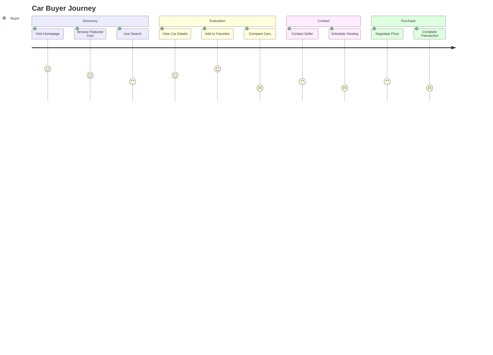

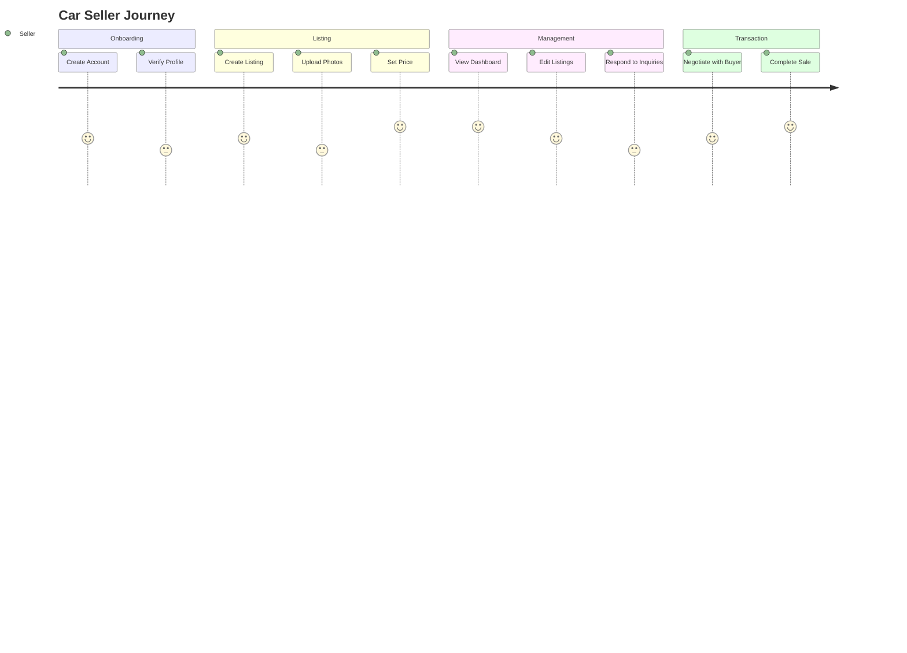

---

## User Stories

### Epic 1: User Authentication & Profile Management

#### Story 1.1: User Registration

**As a** potential car buyer/seller  
**I want to** create an account with my email and phone number  
**So that** I can access the marketplace features

**Acceptance Criteria:**

- User can register with email, name, and phone number
- Email verification is required before full access
- Role selection (buyer/seller) during registration
- Arabic language support in forms

#### Story 1.2: Profile Management

**As a** registered user  
**I want to** manage my profile information and avatar  
**So that** I can present myself professionally to other users

**Acceptance Criteria:**

- Upload and change profile picture
- Edit personal information
- View account creation date and activity

### Epic 2: Car Listing Management

#### Story 2.1: Create Car Listing

**As a** car seller  
**I want to** create detailed car listings with multiple photos  
**So that** potential buyers can find and evaluate my car

**Acceptance Criteria:**

- Upload multiple high-quality images
- Fill detailed car information (make, model, year, mileage, etc.)
- Set pricing and contact information
- Preview listing before publishing

#### Story 2.2: Manage Listings

**As a** car seller  
**I want to** view, edit, and delete my car listings  
**So that** I can keep my inventory up-to-date

**Acceptance Criteria:**

- Dashboard showing all my listings
- Edit listing details and images
- Mark cars as sold
- View listing statistics

### Epic 3: Car Discovery & Search

#### Story 3.1: Browse Cars

**As a** car buyer  
**I want to** browse available cars with filtering options  
**So that** I can find cars that match my criteria

**Acceptance Criteria:**

- Filter by price range, make, model, year
- Sort by price, date, mileage
- View results in grid or list format
- Pagination for large result sets

#### Story 3.2: Car Details

**As a** car buyer  
**I want to** view detailed information about a specific car  
**So that** I can make an informed decision

**Acceptance Criteria:**

- High-resolution image gallery
- Complete technical specifications
- Seller contact information
- Location information

### Epic 4: Favorites & Comparison

#### Story 4.1: Save Favorites

**As a** car buyer  
**I want to** save cars to my favorites list  
**So that** I can easily return to cars I'm interested in

**Acceptance Criteria:**

- Add/remove cars from favorites
- View favorites list
- Favorites persist across sessions
- Quick access to favorite cars

---

## Database Design

### Entity Relationship Diagram

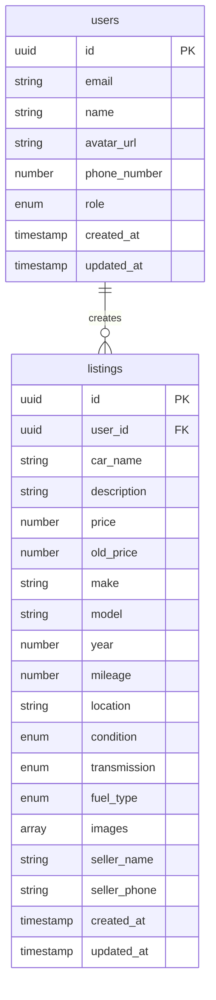

### Database Schema Analysis

#### Strengths

- **Normalized Design**: Proper separation of users and listings
- **Type Safety**: Strong typing with enums for categorical data
- **Scalability**: UUID primary keys for distributed systems
- **Audit Trail**: Created/updated timestamps

#### Architecture Decision: Client-Side Favorites

✅ **DECISION MADE**: Favorites will be **client-side only** using Zustand + localStorage

**Rationale:**

- **Simplicity**: No database complexity for favorites
- **Performance**: Instant favorites without server round-trips
- **Privacy**: User preferences stay on device
- **Scalability**: Reduces database load

**Trade-offs Accepted:**

- ❌ No cross-device sync (acceptable for MVP)
- ❌ No server-side favorites analytics (can be added later)
- ✅ Fast, responsive user experience

#### Missing Database Tables (Future Considerations)

For future features that **will** need database storage:

- `messages` - For buyer-seller communication
- `reviews` - For user ratings and reviews
- `notifications` - For system notifications

---

## Security & Authentication

### Authentication Flow

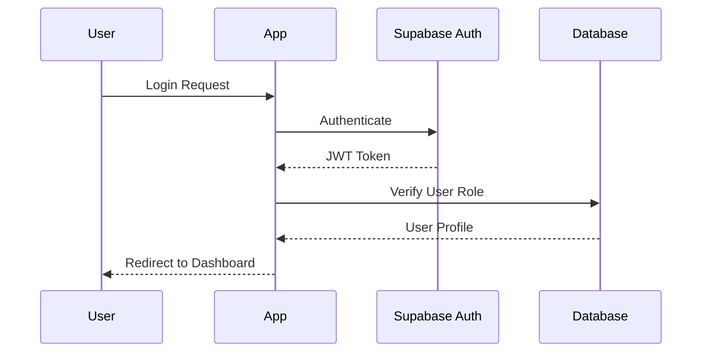

### Security Measures

1. **Authentication**

   - Supabase Auth with JWT tokens
   - Role-based access control
   - Protected routes with middleware

2. **Authorization**

   - Server-side permission checks
   - User ownership validation for listings
   - Admin role for elevated permissions

3. **Data Protection**
   - Server actions for secure data mutations
   - Input validation with Zod schemas
   - File upload restrictions

### Security Recommendations

- Implement rate limiting
- Add CSRF protection
- Enhance input sanitization
- Add audit logging
- Implement data encryption for sensitive fields

---

## Performance & Scalability

### Current Performance Features

1. **Next.js Optimizations**

   - App Router with Server Components
   - Static generation where possible
   - Image optimization with Next.js Image

2. **Database Performance**
   - Supabase with PostgreSQL
   - Connection pooling
   - Real-time subscriptions capability

### Performance Bottlenecks

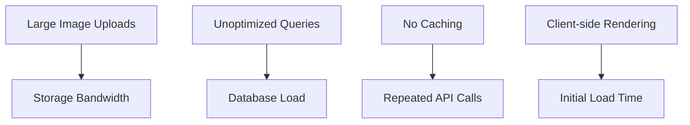

### Scalability Considerations

1. **Database Scaling**

   - Need for read replicas
   - Query optimization
   - Proper indexing strategy

2. **File Storage**

   - CDN implementation
   - Image compression
   - Progressive loading

3. **Application Scaling**
   - Horizontal scaling with Vercel
   - Edge functions for global performance
   - Caching strategies

---

## Technical Debt Analysis

### Critical Issues (High Priority - Fix Immediately)

#### 1. **Testing Infrastructure (CRITICAL - UNRESOLVED)**

**Impact**: High risk of bugs in production, difficult to refactor safely  
**Location**: Entire codebase  
**Current State**: No testing framework detected

**Solution Steps:**

```bash
# Install testing dependencies
npm install --save-dev jest @testing-library/react @testing-library/jest-dom @types/jest

# Set up Jest configuration
# Add test scripts to package.json
# Create essential test files for critical components
```

#### 2. **Inconsistent Error Handling (NEEDS ATTENTION)**

**Impact**: Poor user experience, difficult debugging  
**Location**: Various server actions  
**Current State**: Mix of error formats, no centralized error handling

**Solution**: Create centralized error handling utilities and standardize error responses

### Updated Architecture: Client-First Favorites

**Benefits of Client-Only Approach:**

1. **Instant Response**: No server latency for favorites
2. **Offline Support**: Works without internet connection
3. **Reduced Server Load**: No database queries for favorites
4. **Privacy**: User preferences stay local
5. **Simplicity**: No complex sync logic needed

**Implementation Details:**

```typescript
// ✅ Current implementation is correct
const { isFavorite, toggleFavorite } = useFavoritesStore();

// User clicks favorite button
const handleFavorite = () => {
  toggleFavorite(carId); // ✅ Instant update, persists to localStorage
};
```

### Immediate Cleanup Checklist (COMPLETED ✅)

**Step 1: Remove Server Actions (✅ COMPLETED)**

```bash
# ✅ COMPLETED: Removed getUserFavorites, addToFavorites, removeFromFavorites from src/app/actions.ts
```

**Step 2: Remove TanStack Query (✅ COMPLETED)**

```bash
# ✅ COMPLETED: Successfully removed @tanstack/react-query
npm uninstall @tanstack/react-query --force
```

**Step 3: Find and Remove Imports (✅ COMPLETED)**

```bash
# ✅ COMPLETED: No remaining favorites server action imports found
```

**Step 4: Reorganize Code Architecture (✅ COMPLETED)**

```bash
# ✅ COMPLETED: Moved getLatestListings from global actions to feature-specific location
# - MOVED: src/app/actions.ts → src/features/public-listings/actions.ts
# - UPDATED: Homepage import to use proper feature-based import
# - IMPROVED: Added consistent data normalization across all public listing functions
```

**Step 5: Test Favorites Functionality**

```bash
npm run dev
# Test:
# 1. Add car to favorites - should work instantly
# 2. Refresh page - favorites should persist
# 3. Remove from favorites - should work
# 4. Check browser localStorage for "car-favorites" key
```

### Updated Architecture: Improved Code Organization

**Benefits of Feature-Based Organization:**

1. **Clear Separation**: Each feature owns its data access layer
2. **Reduced Global Scope**: Global actions only contain truly shared functionality
3. **Consistent Patterns**: All listing operations are now in feature-specific modules
4. **Better Maintainability**: Related code is co-located

**Current Organization (After Cleanup):**

```typescript
// ✅ CORRECT: Feature-specific actions
src/features/public-listings/actions.ts
├── getLatestListings()     // Homepage featured cars
├── getAllListings()        // All public listings page
└── getPublicListingById()  // Single listing page

src/features/listings/actions.ts
├── getUserListings()       // Dashboard user listings
├── createListing()         // Create new listing
├── updateListing()         // Edit existing listing
└── deleteListing()         // Delete listing

// ✅ CORRECT: Global shared actions only
src/app/actions.ts
├── getCurrentUser()        // User authentication
├── getUserProfile()        // User profile data
├── updateUserProfile()     // Profile updates
└── updateAvatar()          // Avatar management
```

### Resolved Issues ✅

#### 1. **~~Component Organization & Cleanup~~** ✅ **RESOLVED**

- ✅ Removed unused components: `Navigation.tsx`, duplicate `hero.tsx`, `testimonials.tsx`
- ✅ Deleted redundant `header.tsx` and `user-nav.tsx` (replaced with modular system)
- ✅ Moved `form-card-skeleton.tsx` to `features/listings/components/`
- ✅ Moved `hero-section-4.tsx` to `features/home/components/hero-section.tsx`
- ✅ Fixed filename typo: `testimonals.tsx` → `testimonials.tsx`

#### 2. **~~Build & Icon Issues~~** ✅ **RESOLVED**

- ✅ Fixed incorrect lucide-react icon imports in `spinner.tsx`
- ✅ Added "use client" directive to `UserMenu.tsx`
- ✅ Created missing `form-card-skeleton.tsx` component
- ✅ Build now passes with zero errors and warnings

#### 3. **~~Layout Architecture Optimization~~** ✅ **RESOLVED**

- ✅ Confirmed optimal Route Groups implementation:
  - `(public)/` routes get header + footer via `(public)/layout.tsx`
  - `(auth)/` routes get auth-specific layout via `(auth)/layout.tsx`
  - `dashboard/` routes get sidebar layout via `dashboard/layout.tsx`
  - Root layout is minimal (no header/footer)
- ✅ Dashboard layout now uses inline header with modular `UserMenu`
- ✅ Unified user data fetching with `getUserWithProfile()`

#### 4. **~~Type Organization~~** ✅ **RESOLVED**

- ✅ Centralized type definitions in `src/types/index.ts`
- ✅ Simplified user types to use `DatabaseUser = Tables<'users'>`
- ✅ Updated all imports to use `@/types` instead of scattered definitions

#### 5. **~~Component Architecture Improvements~~** ✅ **RESOLVED**

- ✅ Clean separation between shared (`src/components/`) and feature-specific components
- ✅ Modular header system with `UserMenu`, `UserMenuDropdown`, `UserAvatar`
- ✅ Icon-first design across all menu variants (desktop dropdown, mobile dropdown, mobile sheet)
- ✅ Enhanced loading states with comprehensive skeleton components

### Remaining Technical Debt (Lower Priority)

#### 5. **Missing Testing Infrastructure**

**Impact**: High risk of bugs in production, difficult to refactor safely  
**Location**: Entire codebase  
**Current State**: No testing framework detected

**Solution Steps:**

```bash
# Install testing dependencies
npm install --save-dev jest @testing-library/react @testing-library/jest-dom @types/jest

# Set up Jest configuration
# Add test scripts to package.json
# Create essential test files
```

#### 6. **Inconsistent Error Handling**

**Impact**: Poor user experience, difficult debugging  
**Location**: Various server actions  
**Current State**: Mix of error formats, no centralized error handling

**Solution**: Create centralized error handling utilities and standardize error responses

### Data Flow (Updated - Clean Architecture)

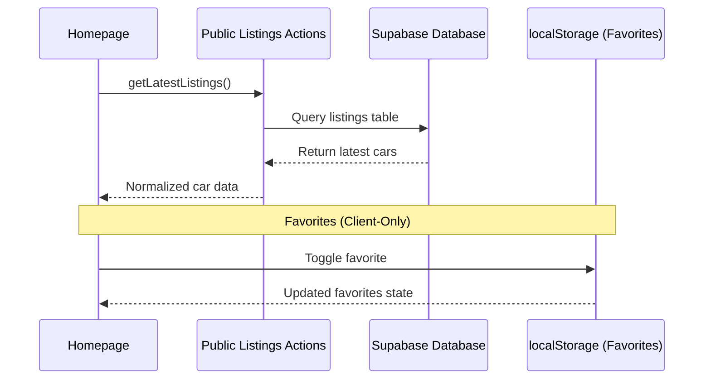

**Clean Separation:** Server data fetching vs client-side preferences are now properly separated.

---

## Recommendations

### Immediate Improvements (1-2 months)

1. **Testing Infrastructure**

   - Set up Jest and React Testing Library
   - Write tests for critical server actions
   - Add component testing for key features

2. **Error Handling Standardization**

   - Create centralized error handling utilities
   - Implement consistent error response format
   - Add user-friendly error messages in Arabic

3. **Database Performance**
   - Add essential database indexes
   - Optimize existing queries
   - Implement query result caching

### Medium-term Enhancements (3-6 months)

1. **Feature Development**

   - Build messaging system between users
   - Implement advanced search and filtering
   - Create mobile-responsive improvements

2. **Business Intelligence**

   - Add analytics dashboard for sellers
   - Implement user behavior tracking
   - Create performance metrics monitoring

3. **Security Enhancements**
   - Add rate limiting and CSRF protection
   - Implement advanced input sanitization
   - Create audit logging system

### Long-term Strategic Goals (6+ months)

1. **Market Expansion**

   - Add multi-language support beyond Arabic
   - Implement regional customization features
   - Integrate with external automotive services

2. **Advanced Features**

   - Develop AI-powered car valuation
   - Create virtual car tour functionality
   - Add financing and payment integration

3. **Platform Evolution**
   - Consider microservices architecture for scale
   - Implement real-time notifications system
   - Build advanced recommendation engine

---

## Conclusion

**بورصتي** represents a solid foundation for a modern car marketplace platform. The technical architecture is well-designed with modern technologies, but there are critical technical debt issues that need immediate attention to ensure scalability and maintainability.

### Key Strengths

- Modern, type-safe codebase with Next.js 15 and React 19
- Scalable architecture with Supabase backend
- Arabic-first approach with RTL support
- Clean feature-based organization

### Critical Areas Requiring Immediate Action

1. **Testing Infrastructure** - Essential for safe development and deployment
2. **Error Handling** - Critical for user experience and debugging
3. **Database Optimization** - Required for performance at scale
4. **Input Validation** - Security and data integrity concerns

### Success Metrics to Track

- **Technical**: Test coverage >80%, API response times <200ms, Error rates <1%
- **Business**: User registration growth, listing creation rate, time-to-contact between buyers/sellers
- **User Experience**: Page load times, mobile responsiveness, user satisfaction scores

The platform is well-positioned for growth with the right investments in technical infrastructure and feature completeness. Addressing the identified technical debt systematically will ensure a robust foundation for future expansion.
